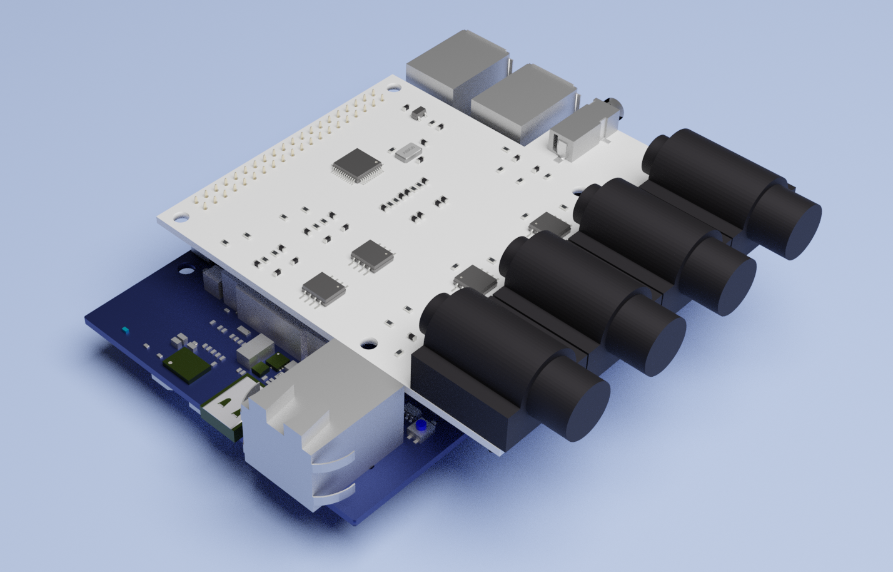
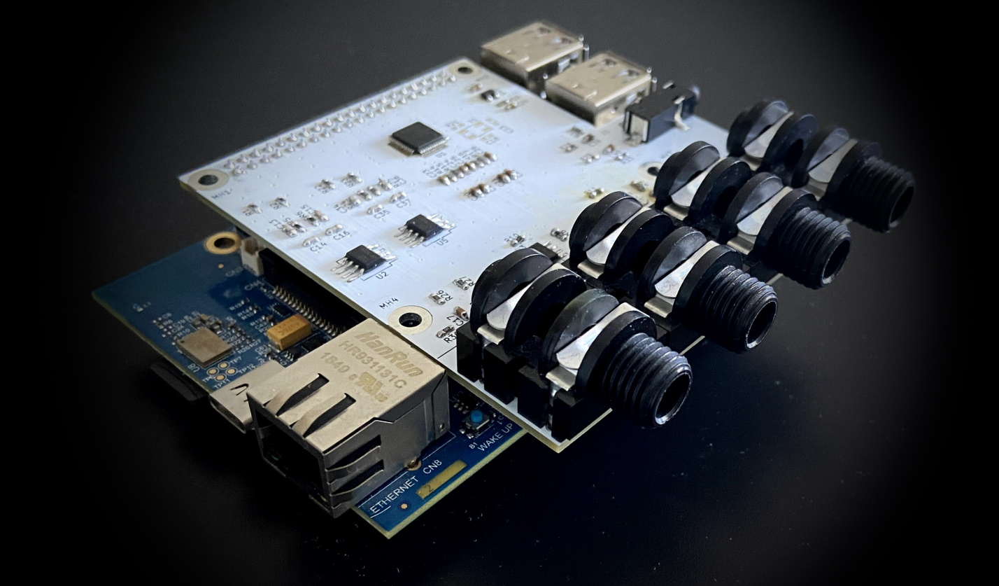
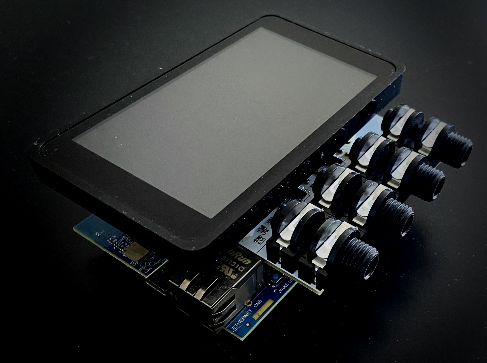

# STM32MP1-AudioBox

Jump to the [Quick Start guide](https://github.com/teodaria/STM32MP1-AudioBox/wiki/Quick-Start-guide) 

**STM32MP1-AudioBox** is a project built around [**STM32MP157C-DK2**](https://www.st.com/en/evaluation-tools/stm32mp157c-dk2.html) development board which adds an audio interface for musical instruments to the MP1 development kit.

The project is based on two main items:
* A **custom sound card** based on the codec [AD1938](https://www.analog.com/media/en/technical-documentation/data-sheets/AD1938.pdf) by Analog Devices, which integrates the codec itself, the input and output connectors as well as a 40 pin connector to plug this piece of hardware on the STM32MP157C-DK2 board. The main features of the board are:
	* AD1938 codec
	* 2 inputs connectors
	* 2 otputs connectors
	* Headphones connector
	* Analog circuitry to properly handle the signals, based on ST OpAmps
	
The board has been designed using [KiCad EDA](https://kicad-pcb.org/): a Cross Platform and Open Source Electronics Design Automation Suite.
The sources for the hardware are freely available [here](https://github.com/teodaria/audio_hw_if).

* A **custom linux distribution** based on Open Embedded, which integrates:	
	* A custom [meta-audiobox-kernel OE layer](https://github.com/teodaria/meta-audiobox-kernel) created to support the new sound card. It contains the kernel patches for the ASoC codec driver, a specific ASoC machine driver to support the audio card and the required patches to the linux device tree. The implementation is still minimal. You can find all the information on this specific layer in the specific [repository](https://github.com/teodaria/meta-audiobox-kernel).  
	* A custom [meta-audiobox-distro OE layer](https://github.com/teodaria/meta-audiobox-distro), containing two OE/Yocto images definitions (with or withouth LCD support) and one distribution.
	* Standard OE/Yocto [BSP layer from STMicroelectronics](https://github.com/STMicroelectronics/meta-st-stm32mp)
	* Audio software as provided by the [meta-musicians OE layer](https://github.com/schnitzeltony/meta-musicians). By default 3 audio-related open source applications are installed in the rootfs in the images:
		* [QjackCtl](https://qjackctl.sourceforge.io/): QjackCtl is a simple Qt application to control the JACK sound server daemon 
		* [Calf studio gear](https://calf-studio-gear.org/): stand-alone effect rack connectable through Jack sound server or as plug-ins in every audio host that is able to fire up LV2 compilant devices
		* [Guitarix](https://guitarix.org/?_sm_nck=1): a virtual guitar amplifier for Linux running on Jack Audio Connection Kit
	
Git repo is used to manage the distribution: a [manifest](https://github.com/teodaria/MP1-audiobox-manifest) is made available to easily download all the required OE layers and quickly start the distribution build.

Here's a summary of the repositories and useful links:

|Links|
| --- |
|[QuickStart guide](https://github.com/teodaria/STM32MP1-AudioBox/wiki/Quick-Start-guide)|
|Main [manifest](https://github.com/teodaria/MP1-audiobox-manifest) with all the layers|
|Custom meta-audiobox-kernel [layer](https://github.com/teodaria/meta-audiobox-kernel) for the kernel patches|
|Custom meta-audiobox-distro [layer](https://github.com/teodaria/meta-audiobox-distro) containing images and distribution definitions|
|Standard OE/Yocto [BSP layer](https://github.com/STMicroelectronics/meta-st-stm32mp) from STMicroelectronics|
|meta-musicians [layer](https://github.com/schnitzeltony/meta-musicians)|
|OpenEmbedded [Git Repository](https://git.openembedded.org/)|
|[QT5 layer](https://github.com/meta-qt5/meta-qt5)|
|[STM32MP157C-DK2](https://www.st.com/en/evaluation-tools/stm32mp157c-dk2.html) evaluation board webpage (for information, schematics, documents...)|

3D model used during development for checking mechanical constraints:

Photos:

